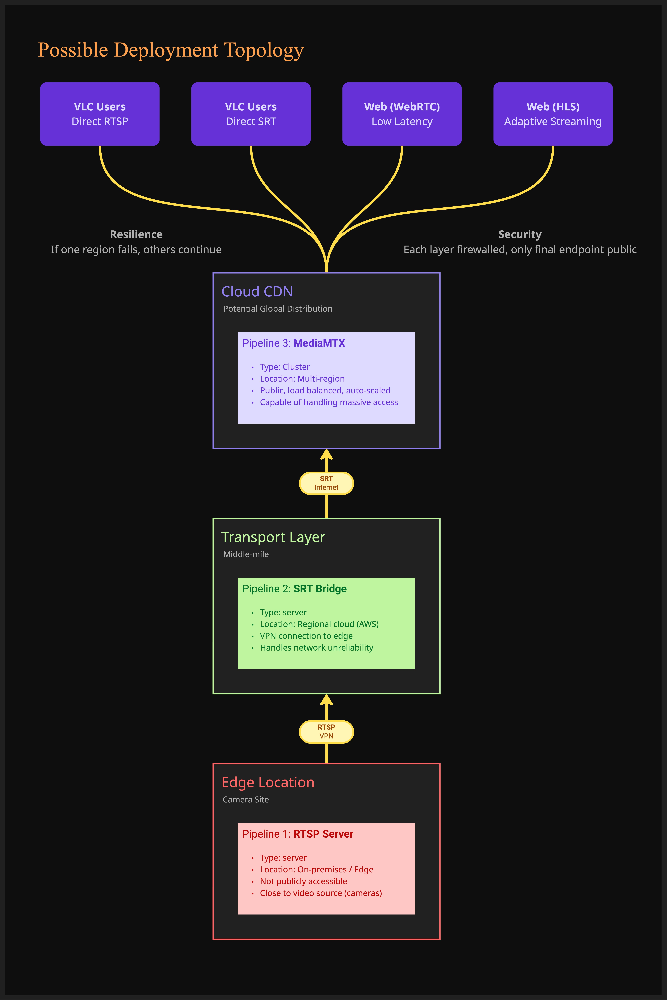

# Hawkeye Video Pipeline

A production-ready video pipeline that ingests, re-transports, and serves video across heterogeneous networks and clients.

## About This PoC

This proof-of-concept demonstrates a complete live video streaming pipeline that:

1. **Ingests** video from a file and serves it over RTSP
2. **Re-transports** the RTSP stream to SRT for reliable delivery
3. **Serves** the content via multiple protocols (SRT, WebRTC, HLS) for different client needs

### Goals

- Demonstrate protocol translation between RTSP, SRT, and browser-compatible formats
- Implement resilient stream handling with automatic reconnection and backoff
- Provide a containerized, production-ready deployment
- Compare streaming protocols for different use cases

### Components

| Component | Description | Technology |
|-----------|-------------|------------|
| **Pipeline 1** | File → RTSP server | Rust + GStreamer |
| **Pipeline 2** | RTSP → SRT with reconnect logic | Rust + GStreamer |
| **Pipeline 3** | Multi-protocol media server | MediaMTX |

### Key Features

- **Multi-protocol support**: RTSP, SRT, HLS, and WebRTC from a single source
- **Resilience**: Automatic reconnection with exponential backoff
- **Browser playback**: WebRTC for low-latency, HLS for compatibility
- **VLC playback**: Both RTSP and SRT streams accessible
- **Monitoring**: REST API and Prometheus metrics
- **Containerized**: Full Docker Compose deployment

## Architecture



## Prerequisites

### macOS (Homebrew)

```bash
# GStreamer and plugins
brew install gstreamer gst-plugins-base gst-plugins-good gst-plugins-bad gst-plugins-ugly gst-libav gst-rtsp-server

# MediaMTX server
brew install mediamtx

# Rust (if not installed)
curl --proto '=https' --tlsv1.2 -sSf https://sh.rustup.rs | sh
```

### Verify Installation

```bash
gst-launch-1.0 --version
mediamtx --version
cargo --version
```

## Quick Start

### Option 1: Docker Compose (Recommended)

**One-command deployment of all services:**
```bash
docker compose up -d
```

This starts all three pipelines:
- Pipeline 1 (File → RTSP) on port 8554
- Pipeline 2 (RTSP → SRT) connecting them
- Pipeline 3 (MediaMTX) exposing SRT/HLS/WebRTC

**View logs:**
```bash
docker compose logs -f
```

**Stop all services:**
```bash
docker compose down
```

### Option 2: Run Services Manually

**Terminal 1 - Pipeline 1 (File → RTSP):**
```bash
cd pipeline-rtsp
cargo run
# Output: RTSP server ready at rtsp://127.0.0.1:8554/cam1
```

**Terminal 2 - Pipeline 3 (MediaMTX Server):**
```bash
cd server
mediamtx mediamtx.yml
```

**Terminal 3 - Pipeline 2 (RTSP → SRT):**
```bash
cd pipeline-rtsp-to-srt
RUST_LOG=info cargo run
# Output: Publishing to srt://127.0.0.1:9000
```

### Option 3: Hybrid (MediaMTX in Docker, Pipelines local)

```bash
cd server
docker compose up -d
# Then run Pipeline 1 and 2 manually as in Option 2
```

## Test URLs

| Protocol | URL | Client |
|----------|-----|--------|
| **RTSP** (P1) | `rtsp://127.0.0.1:8554/cam1` | VLC, ffplay |
| **SRT Read** | `srt://127.0.0.1:9000?streamid=read:cam1` | VLC |
| **HLS** | `http://localhost:8888/cam1/` | Browser |
| **WebRTC** | `http://localhost:8889/cam1/` | Browser |
| **API** | `http://localhost:9997/v3/paths/list` | curl, Browser |
| **Metrics** | `http://localhost:9998/metrics` | Prometheus |

### VLC Commands

```bash
# Watch RTSP directly from Pipeline 1
vlc rtsp://127.0.0.1:8554/cam1

# Watch SRT from MediaMTX
vlc "srt://127.0.0.1:9000?streamid=read:cam1"
```

### FFplay Commands

```bash
# RTSP
ffplay rtsp://127.0.0.1:8554/cam1

# SRT
ffplay "srt://127.0.0.1:9000?streamid=read:cam1"
```

---

## Technical Documentation

### Project Structure

```
hawkeye/
├── docker-compose.yml              # Orchestrates all 4 services
├── README.md                       # Documentation
├── pipeline-rtsp/                  # Pipeline 1: File → RTSP
│   ├── Cargo.toml
│   ├── Dockerfile
│   └── src/
│       ├── main/rust/
│       │   ├── main.rs             # Entry point
│       │   ├── lib.rs              # Module exports
│       │   ├── config.rs           # CLI configuration
│       │   ├── domain/             # Business logic (pure)
│       │   │   ├── entities/       # StreamSession
│       │   │   ├── value_objects/  # ServerConfig, StreamConfig, VideoCodec
│       │   │   ├── ports/          # StreamingServer, MetricsReporter traits
│       │   │   └── errors/         # DomainError enum
│       │   ├── application/        # Use cases
│       │   │   └── services/       # StreamingService
│       │   └── infrastructure/     # Technical implementations
│       │       ├── gstreamer/      # GStreamerRtspServer, PipelineBuilder
│       │       └── metrics/        # PrometheusReporter, HTTP server
│       ├── test/rust/              # Unit & integration tests
│       └── resources/              # Video files (camera1.mp4, camera2_fixed.mp4)
│
├── pipeline-rtsp-to-srt/           # Pipeline 2: RTSP → SRT Bridge
│   ├── Cargo.toml
│   ├── Dockerfile
│   └── src/
│       ├── main/rust/
│       │   ├── main.rs
│       │   ├── lib.rs
│       │   ├── config.rs
│       │   ├── domain/
│       │   │   ├── entities/       # ConnectionLifecycle
│       │   │   ├── value_objects/  # ConnectionState, BackoffPolicy, BridgeConfig
│       │   │   ├── ports/          # StreamBridge, MetricsReporter traits
│       │   │   └── errors/
│       │   ├── application/
│       │   │   └── services/       # BridgeService (reconnection logic)
│       │   └── infrastructure/
│       │       ├── gstreamer/      # GStreamerBridge, PipelineBuilder
│       │       └── metrics/        # PrometheusReporter
│       └── test/rust/
│
└── server/                         # Pipeline 3: MediaMTX + Web Dashboard
    ├── Dockerfile
    ├── mediamtx.yml                # MediaMTX configuration
    └── web/
        └── index.html              # Dashboard (1600+ lines)
```

### Domain-Driven Design Architecture

Both Rust pipelines follow Clean Architecture with ports and adapters:

**Layer Separation:**
```
┌─────────────────────────────────────────────────────────────┐
│  main.rs (Composition Root)                                 │
│  - Parses config, injects dependencies, starts services     │
├─────────────────────────────────────────────────────────────┤
│  Application Layer (services/)                              │
│  - StreamingService, BridgeService                          │
│  - Orchestrates use cases, no business logic                │
├─────────────────────────────────────────────────────────────┤
│  Domain Layer (entities/, value_objects/, ports/, errors/)  │
│  - Pure business logic, no dependencies on infrastructure   │
│  - StreamSession, ConnectionLifecycle, BackoffPolicy        │
├─────────────────────────────────────────────────────────────┤
│  Infrastructure Layer (gstreamer/, metrics/)                │
│  - GStreamer adapters, Prometheus reporters                 │
│  - Implements domain ports (traits)                         │
└─────────────────────────────────────────────────────────────┘
```

**Key DDD Concepts Applied:**

| Concept | Pipeline 1 | Pipeline 2 |
|---------|-----------|-----------|
| Entity | `StreamSession` | `ConnectionLifecycle` |
| Value Objects | `ServerConfig`, `StreamConfig`, `VideoCodec` | `ConnectionState`, `BackoffPolicy`, `BridgeConfig` |
| Ports (Traits) | `StreamingServer`, `MetricsReporter` | `StreamBridge`, `MetricsReporter` |
| Adapters | `GStreamerRtspServer`, `PrometheusReporter` | `GStreamerBridge`, `PrometheusReporter` |

---

### Pipeline 1: File → RTSP Server

**Purpose:** Reads an MP4 file and serves it as an RTSP stream, simulating an IP camera.

**GStreamer Pipeline:**
```
filesrc location=/app/resources/camera2_fixed.mp4
  → qtdemux                    # Demux MP4 container
  → h264parse config-interval=-1  # Parse H.264, emit SPS/PPS regularly
  → rtph264pay name=pay0 pt=96    # Packetize for RTP
```

**Key Classes:**

`StreamSession` (Entity):
```rust
pub struct StreamSession {
    id: String,                    // UUID
    stream_config: StreamConfig,
    server_config: ServerConfig,
    started_at: Instant,
    state: SessionState,           // Starting → Active → Stopping → Stopped
}
```

`GStreamerRtspServer` (Infrastructure):
```rust
impl StreamingServer for GStreamerRtspServer {
    async fn start(&mut self, stream_config, server_config) -> Result<StreamSession> {
        let server = gst_rtsp::RTSPServer::new();
        server.set_service(&port.to_string());

        let factory = gst_rtsp::RTSPMediaFactory::new();
        factory.set_launch(&PipelineBuilder::build_launch_string(&stream_config));
        factory.set_shared(true);

        mounts.add_factory(mount_point, factory);
        server.attach(None)?;  // Critical: binds to port

        Ok(StreamSession::new(stream_config, server_config))
    }
}
```

---

### Pipeline 2: RTSP → SRT Bridge

**Purpose:** Subscribes to Pipeline 1's RTSP stream and publishes to MediaMTX via SRT with automatic reconnection.

**GStreamer Pipeline:**
```
rtspsrc location=rtsp://pipeline-rtsp:8554/cam1 latency=200 protocols=tcp
  → rtph264depay              # Extract H.264 from RTP
  → h264parse config-interval=1  # Ensure SPS/PPS before keyframes
  → video/x-h264,stream-format=byte-stream,alignment=au
  → mpegtsmux alignment=7     # MPEG-TS for SRT (7 packets = 1316 bytes)
  → srtsink uri="srt://mediamtx:9000?..." wait-for-connection=false
```

**Reconnection Logic (BridgeService):**
```rust
pub fn run_with_reconnect(&mut self) -> Result<()> {
    let mut current_backoff = self.backoff_policy.initial_delay();  // 1s

    while self.running.load(Ordering::SeqCst) {
        match self.bridge.run_once() {
            Ok(()) => {
                // EOS (end of stream) - reconnect immediately, reset backoff
                current_backoff = self.backoff_policy.initial_delay();
            }
            Err(e) => {
                // Error - apply exponential backoff
                self.lifecycle.transition_to_reconnecting(attempt, reason);
                std::thread::sleep(current_backoff);
                current_backoff = self.backoff_policy.next_delay(current_backoff);
                // 1s → 2s → 4s → 8s → 16s → 30s (capped)
            }
        }
    }
}
```

**Connection State Machine:**
```
Idle → Connecting → Streaming ←→ Reconnecting{attempt} → Failed
                        ↑              ↓
                        └──────────────┘ (on success)
```

---

### Pipeline 3: MediaMTX Distribution Server

**Purpose:** Receives SRT stream, distributes via multiple protocols.

**Supported Outputs:**
| Protocol | Port | URL | Latency |
|----------|------|-----|---------|
| WebRTC | 8889 | `/cam1/whep` | ~200ms |
| HLS | 8888 | `/cam1/index.m3u8` | ~3-5s |
| RTSP | 8555 | `rtsp://host:8555/cam1` | ~500ms |
| SRT | 9000 | `srt://host:9000?streamid=read:cam1` | ~200ms |

**Key Configuration (`mediamtx.yml`):**
```yaml
srt: yes
srtAddress: :9000

hls: yes
hlsAddress: :8888
hlsSegmentCount: 3
hlsSegmentDuration: 1s

webrtc: yes
webrtcAddress: :8889

paths:
  cam1:
    source: publisher  # Receives from Pipeline 2
```

---

### Web Dashboard

**Location:** `server/web/index.html` (1600+ lines)

**Features:**
- Protocol selector (WebRTC, HLS, RTSP, SRT)
- Live video player with HLS.js and native WebRTC
- Real-time metrics (bitrate, viewers, uptime)
- Pipeline health monitoring
- Auto-reconnection for WebRTC and HLS

**Technologies:** HTML5, CSS3, Vanilla JavaScript, HLS.js

---

### Metrics and Monitoring

**Pipeline 1 (port 9001):**
- `rtsp_active_sessions` - Current streaming sessions
- `rtsp_client_connections_total` - Cumulative connections
- `/health` - Simple OK endpoint

**Pipeline 2 (port 9002):**
- `rtsp_srt_connection_state` - 0=Idle, 1=Connecting, 2=Streaming, 3=Reconnecting, 4=Failed
- `reconnect_attempts_total` - Total reconnection attempts
- `reconnect_backoff_seconds` - Current backoff delay
- `pipeline_uptime_seconds` - Time since streaming started
- `/health` - Simple OK endpoint

**MediaMTX (port 9998):**
- Standard MediaMTX Prometheus metrics
- `/v3/paths/list` REST API for stream status

---

### Docker Deployment

**Start all services:**
```bash
docker-compose up -d
```

**Service dependencies:**
```yaml
pipeline-rtsp-to-srt:
  depends_on:
    pipeline-rtsp:
      condition: service_healthy
    mediamtx:
      condition: service_healthy
```

**Environment configuration:**
```yaml
pipeline-rtsp:
  environment:
    - VIDEO_PATH=/app/resources/camera2_fixed.mp4

pipeline-rtsp-to-srt:
  environment:
    - RTSP_URL=rtsp://pipeline-rtsp:8554/cam1
    - SRT_URL=srt://mediamtx:9000?mode=caller&streamid=publish:cam1&latency=200
```

---

### Testing

**Run all tests:**
```bash
cd pipeline-rtsp && cargo test
cd pipeline-rtsp-to-srt && cargo test
```

**Test coverage:**
- Domain logic (BackoffPolicy, ConnectionState, config validation)
- GStreamer pipeline parsing
- Infrastructure adapters
- Configuration validation

---

### Key Design Decisions

1. **MPEG-TS over SRT** - Required for HLS compatibility and reliable transport
2. **Exponential backoff** - Prevents thundering herd on reconnection
3. **Baseline H.264 profile** - No B-frames for WebRTC/live streaming compatibility
4. **Ports and adapters** - Enables testing and swapping implementations
5. **Separate pipelines** - Isolated failure domains, independent restarts
6. **Health checks** - Docker orchestration and dashboard monitoring

---

## Protocol Comparison

### RTSP vs SRT

| Aspect | RTSP | SRT |
|--------|------|-----|
| **Use Case** | LAN streaming, IP cameras | WAN streaming, unreliable networks |
| **Transport** | TCP/UDP | UDP with ARQ |
| **Latency** | Low (~100-500ms) | Configurable (200ms+) |
| **Reliability** | Depends on transport | Built-in error correction |
| **Firewall** | Multiple ports needed | Single UDP port |
| **When to use** | Internal networks, camera feeds | Internet streaming, contribution |

### WebRTC vs HLS

| Aspect | WebRTC | HLS |
|--------|--------|-----|
| **Latency** | Ultra-low (<500ms) | Higher (2-10s) |
| **Scalability** | Limited (P2P/SFU) | Excellent (CDN-friendly) |
| **Browser Support** | Modern browsers | Universal |
| **Use Case** | Real-time interaction | VOD, large audiences |
| **When to use** | Live interaction, gaming | Broadcast, VOD |

---

## Resilience Testing

Test that Pipeline 2 recovers when Pipeline 1 restarts:

```bash
# In terminal running Pipeline 1, press Ctrl+C to stop it
# Watch Pipeline 2 logs - it will show reconnection attempts:
# [INFO] Pipeline error: Could not open resource...
# [INFO] Reconnecting in 1s...
# [INFO] Reconnecting in 2s...
# [INFO] Reconnecting in 4s...

# Restart Pipeline 1
cd pipeline-rtsp && cargo run

# Pipeline 2 will automatically reconnect
```

---

## Troubleshooting

### HLS returns 404

HLS segments are generated on-demand. Ensure:
1. Pipeline 2 is publishing to MediaMTX
2. Check API: `curl http://localhost:9997/v3/paths/list`
3. The stream needs regular keyframes - Pipeline 2 re-encodes to ensure this

### HLS returns 500 Internal Server Error

The source video likely has B-frames or non-monotonic timestamps. Re-encode without B-frames:
```bash
ffmpeg -i input.mp4 -c:v libx264 -preset fast -profile:v baseline -bf 0 -g 30 -an output.mp4
```

### VLC can't connect to SRT

Verify the streamid format:
```bash
# Reading from MediaMTX
vlc "srt://127.0.0.1:9000?streamid=read:cam1"

# NOT just srt://127.0.0.1:9000
```

### Pipeline 2 keeps reconnecting

Check that Pipeline 1 is running:
```bash
curl rtsp://127.0.0.1:8554/cam1
# Or
ffprobe rtsp://127.0.0.1:8554/cam1
```

### Port already in use

Kill existing processes:
```bash
pkill -f pipeline-rtsp
pkill -f mediamtx
```

---

## License

MIT
